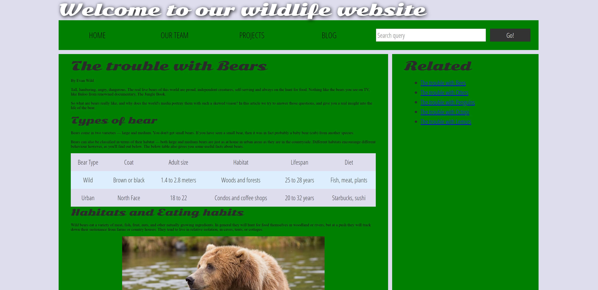
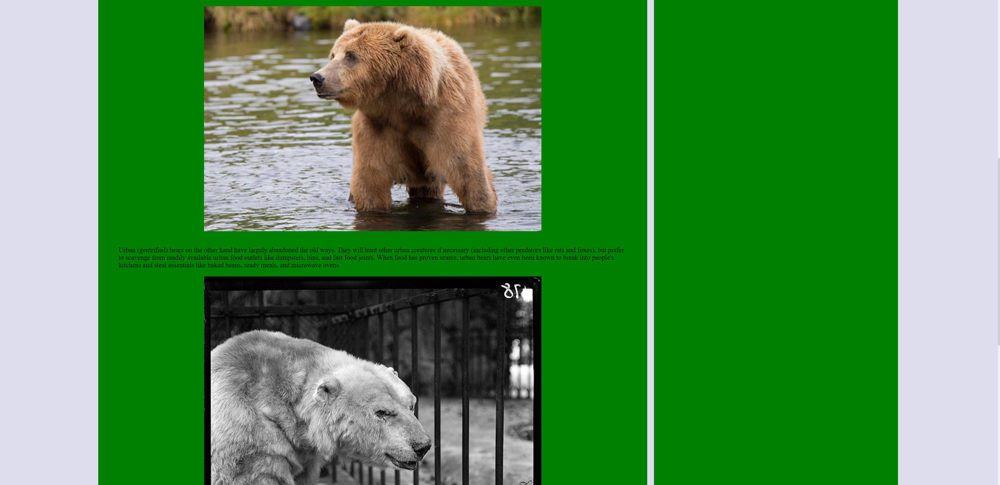
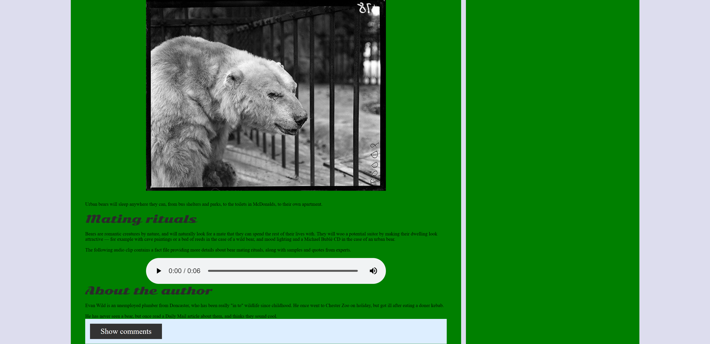
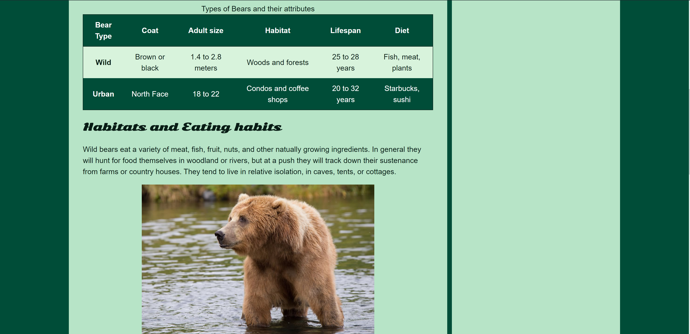
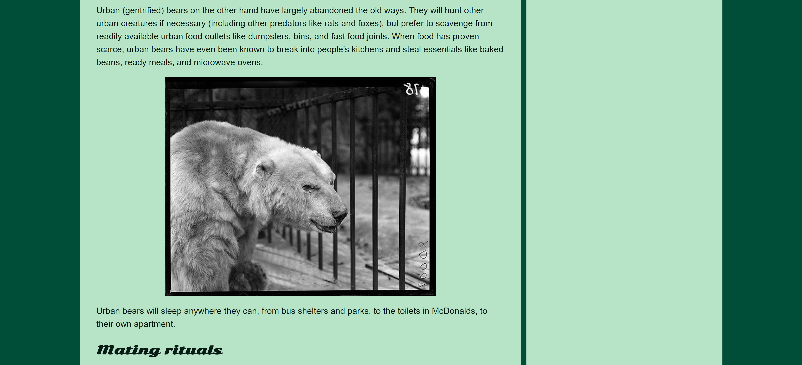
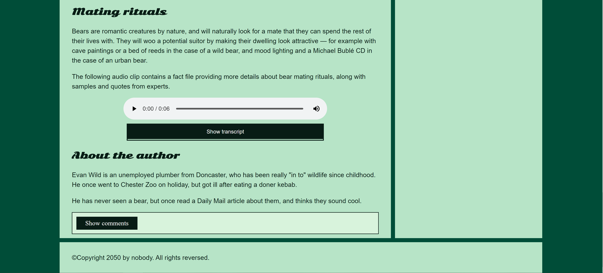
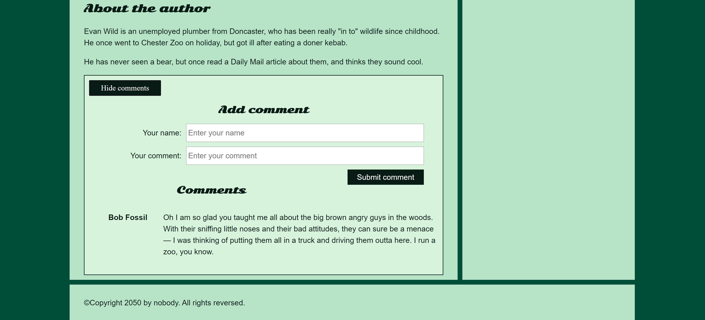

<h1>
  Assessment: Accessibility Troubleshooting
</h1>
  
<h2 id="table-of-contents">Table of contents</h2>

* [Introduction](#introduction)
* [Features](#features)
* [Launch](#launch)
* [Screenshots](#screenshots)
* [Technologies](#technologies)

<h2 id="introduction">Introduction</h2>

This is a repository of my (Jose Nicolas Mora) completion of the [MDN Accessibility Troubleshooting Assessment](https://developer.mozilla.org/en-US/docs/Learn/Accessibility/Accessibility_troubleshooting).

In this project we are presented with a fictional nature site displaying an article about bears. The original webpage has multiple accessibility issues, and my task was to explore the existing site and fix several of them.

The website was tested for accessibility using the [NVDA screenreader tool](https://www.nvaccess.org).

Check out my [LinkedIn](https://linkedin.com/in/nicolas-mora-a54245105/)

<h2 id="features">Features</h2>

The accessibility improvements include:
- Improved color contrast
  - I also added a better, more suitable color scheme.
- More semantic html tags.
- Skip to main content link.
- More accessible images with alt text and figure tags.
- Text representation of text file to make audio player more accessible to screenreader users.
- The audio player is now more accessible to users that are using older browsers that dont support HTML5 audio.
- The input element in the search form now has label only accessible to screenreaders.
- The two <input> elements in the comment form have better labels.
- Show/hide comment control button is now key-board accessible.
- Comments are tabbable to improve screenreader accessibility.
- Table is now more accessible to screenreader users.
  - Data rows and columns are better associated.
  - Table summary was added.

<h2 id="launch">Launch</h2>

The old webpage is located in the [original-webpage-poor-accessibility folder](./original-webpage-poor-accessibility). Open its [index.html file](./original-webpage-poor-accessibility/index.html) to open it.

The new webpage is located in the [improved-webpage-better-accessibility folder](./improved-webpage-better-accessibility). [Visit the deployed webpage](https://nikelausm.github.io/accessibility-exercise/index.html), or open its [index.html file](./improved-webpage-better-accessibility./index.html) to open it.

<h2 id="screenshots">Screenshots</h2>

### Old Webpage With Poor Accessibility

### New Webpage With Better Accessibility

<h2 id="technologies">Technologies</h2>

- HTML5
- CSS3
- Javascript
- [WebAIM Contrast Checker](https://webaim.org/resources/contrastchecker/)
- [Coolors.co color scheme generator](https://coolors.co)
- [NVDA Screenreader Tool](https://www.nvaccess.org) 
